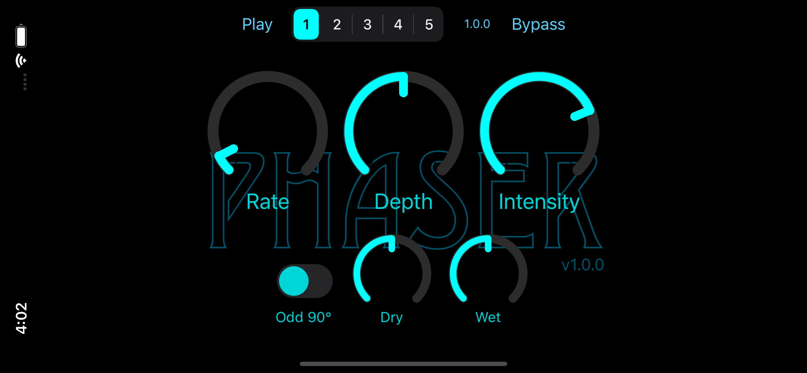

[](https://swift.org)
[](https://developer.apple.com/documentation/audiotoolbox/audio_unit_v3_plug-ins)
[](https://opensource.org/licenses/MIT)



# About SimplyPhaser

This is full-featured AUv3 effect that acts like the phaser stomp boxes of old. It is for both iOS and macOS
platforms. When configured, it will build an app for each platform and embed in the app an app extension
containing the AUv3 component. The apps are designed to load the component and use it to demonstrate how it
works by playing a sample audio file and routing it through the effect.

<div align="center">
  <a href="https://www.youtube.com/watch?v=vH6bEQEkcdo"></a>
</div>

Additional features and info:

* uses an Objective-C++ kernel for audio sample manipulation in the render thread
* provides a *very* tiny Objective-C interface to the kernel for access with Swift
* uses Swift for all UI and all audio unit work not associated with rendering

The code was developed in Xcode 12.4 on macOS 11.2.1. I have tested on both macOS and iOS devices primarily in
GarageBand, but also using test hosts on both devices as well as the excellent
[AUM](https://apps.apple.com/us/app/aum-audio-mixer/id1055636344) app on iOS.

Finally, it passes all
[auval](https://developer.apple.com/library/archive/documentation/MusicAudio/Conceptual/AudioUnitProgrammingGuide/AudioUnitDevelopmentFundamentals/AudioUnitDevelopmentFundamentals.html)
tests:

```
% auval -v aufx phzr BRay
```

## Phaser Algorithm

This effect is based on a design described in the excellent book
["Designing Audio Effects Plugins in C++"](https://www.amazon.com/Designing-Audio-Effect-Plugins-C-dp-1138591939/dp/1138591939/ref=dp_ob_title_bk)
by [Will Pirkle](https://www.willpirkle.com). His design uses six all-pass filters to do the phase shifting in 6 overlapping bands ranging from 16Hz to 20kHz.
In the book, he mentions that his design was "derived from the analog circuit in the _National Semiconductor (NSC) Audio/Radio Handbook_, a 1970s source of old
App Notes from National Semiconductor... The NSC design used six 1st order all-pass stages that were modulated from a common LFO."

You can find Pirkle's implementation in the [fxobjects.h](https://github.com/bradhowes/SimplyPhaser/blob/9f06b552f06b301a14b65400cbc8b57a319a271b/Shared/Kernel/Pirkle/fxobjects.h#L3537) file. Note that the effect 
uses my own C++ implementation that I think is a bit more straightforward. There are unit tests that compare the two for implementation correctness.

Note that most of the the C++ code that does the filtering is found in the 
[AUv3Support Swift package](https://github.com/bradhowes/AUv3Support)
that this project depends on. The 
[PhaseShifter.hpp](https://github.com/bradhowes/AUv3Support/blob/main/Sources/DSPHeaders/include/PhaseShifter.hpp) class contains the pipeline that does the
filtering on the samples. It relies on a collection of 6
[biquad filters](https://github.com/bradhowes/AUv3Support/blob/main/Sources/DSPHeaders/include/Biquad.hpp)
configured in all-pass mode.

## Demo Targets

The macOS and iOS apps are simple hosts that demonstrate the functionality of the AUv3 component. In the AUv3
world, an app serves as a delivery mechanism for an app extension like AUv3. When the app is installed, the
operating system will also install and register any app extensions found in the app.

The `SimplyPhaser` apps attempt to instantiate the AUv3 component and wire it up to an audio file player and the
output speaker. When it runs, you can play the sample file and manipulate the filter settings -- cutoff
frequency in the horizontal direction and resonance in the vertical. You can control these settings either by
touching on the graph and moving the point or by using the sliders to change their associated values. The
sliders are somewhat superfluous but they act on the AUv3 component via the AUPropertyTree much like an external
MIDI controller might do.

## Code Layout

Each OS ([macOS](macOS) and [iOS](iOS)) app has the same basic layout:

* `App` -- code and configury for the application that hosts the AUv3 app extension
* `Extension` -- code and configury for the extension itself

However, most of the code you will find elsewhere, either in the Swift Packages Sources folder that holds some code and resources common to both platforms, or
more likely in the [AUv3Support Swift package](https://github.com/bradhowes/AUv3Support) mentioned above.

## Rolling Your Own

> :warning: You are free to use the code according to [LICENSE.md](LICENSE.md), but you must not replicate
> someone's UI, icons, samples, or any other assets if you are going to distribute your effect on the App Store.

Feel free to fork and do as you please. If you have improvements, I would definitely welcome your feedback. If you are interested in working out your own AUv3
plugins have a look at my [AUv3Template](https://github.com/bradhowes/AUv3Template) project which tries to offer a good place to start with something that you 
can call your own.
